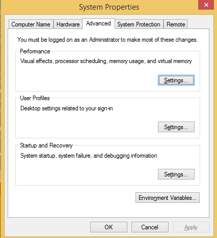
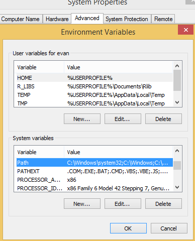
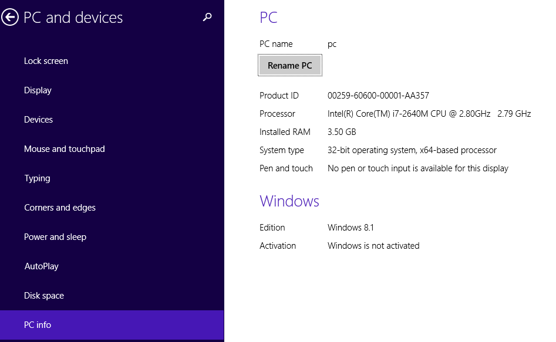
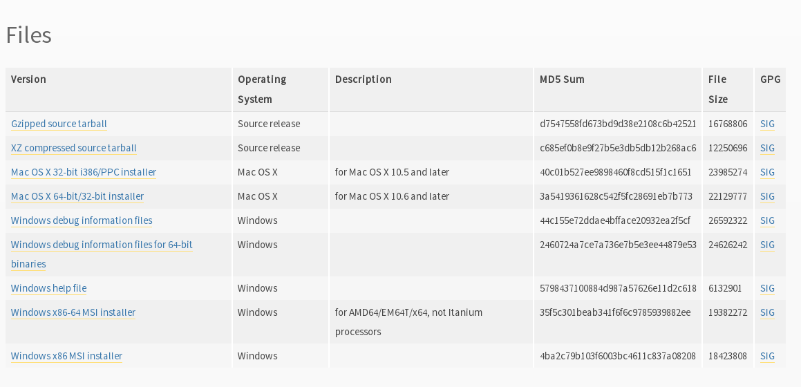
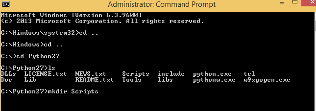

# Purpose

The purpose of this repository is to provide high level instructions
for a class leader to set up a modern cpp IDE on stuudent computers
that is both free and runs on Windows. This tutorial is a written set
of instructions which works on Windows of Baris Yuksel's excellent
videos. Links to the original videos are given below:

1.  <https://www.youtube.com/watch?v=HTUE03LnaXA>
2.  <https://www.youtube.com/watch?v=r_HW0EB67eY>
3.  <https://www.youtube.com/watch?v=Ib914gNr0ys>

# What's with the name?

Windows is terrible. Proprietary software is worse.  This project
should be viewed through the lens of 'harm reduction programs.' The 
best thing by far is to implore students to get off windows like 
they were getting off of Heroin.

However most Computer Science students (girls as well as boys) come to
us after a decade of gaming. Can I play Halo if I switch to Ubuntu? Is there
a version of Grand Theft Auto or Call of Duty for Debian?  Explaining the 
virtues of Free Software has not worked for me.  I even showed students
Richard Stallman's excellent (and brief) TedX talk available at the url below:

<https://www.youtube.com/watch?v=Ag1AKIl_2GM>

The reactions I received were simmilar to exposing them to a Bernie
Sander's rally. "That is a cool old dude. Am I going to change my life? No."

# What's wrong with other alternatives?

## The professional solution

Visual Studio costs $800. So, probably students will only see it in
campus labs. Most lab administrators are too busy to configure
software for classroom use&#x2013;for example, Visual Studio has an AStyle
plugin to write styled code, but on our lab computers this was never
installed, let alone configured.

## What students use

To save money, many students use Bloodshed's Dev-C++.  This has not been
maintained for 10 years and there are more than 340 known unfixed bugs. See
the url below for more detail.

<http://clicktobegin.net/programming/why-you-shouldnt-use-dev-c/>

WHAT ABOUT <http://www.codeblocks.org>?

# Clean Needles

If students will not leave proprietary software alone, I still want
them to learn posix style command line driven development. Here is my
zero cost and Free Solution, directed at instructors running a class,
rather than at students themselves&#x2013;installing this requires using
elisp to load packages and configure packages and python to run
`cpplint`. (Students who can configure a system that requires two
languages other than C++ should be taking a higher level course.)

# Emacs

The hacker's editor.  You can use it for 30 years. The best way for
windows users to get it is via:

<http://vgoulet.act.ulaval.ca/en/emacs/windows/>

# Google C++ Style Guide

This has been operationalized in a python package (library) called
cpplint that is freely available.  Google's style guide is somewhat
controversial in the C++ community: see the video
<https://www.youtube.com/watch?v=NOCElcMcFik> for its philosophy and
<https://news.ycombinator.com/item?id=7900238> for a critique of it.
What is not in doubt, though, is that successful projects adhere to a
style: if you watch only one video linked here, watch Greg
Hartman-Kroah's "I Don't Want Your Code",
<https://www.youtube.com/watch?v=fMeH7wqOwXA>.

# Semantic Auto-Complete

We install auto-complete with semantic parsing for a back end. We also make 
auto-complete aware of our compiler include files.

# Caveat

These instructions do not cover all possible scenarios.  Emacs
packages change version numbers, for example; be prepared to do some minor tweaking. 

# Benefit

Students learn to be comortable on the command line and can add
familiarity with many open source tools incrementally such as gdb and
valgrind.

# Installation

## An easy start

First install modified Emacs for windows from:

<http://vgoulet.act.ulaval.ca/en/emacs/windows/>

Select all of the defaults.  It has a one click installer.  Emacs
is now installed. We will need this tool to configure the rest of 
the packages we will install.

## Cygwin

Second, install Cygwin. Cygwin can be confusing. First, you have to
decide whether to install the 32 bit or 64 bit version.  It depends on
your operating system, I need to add how to tell in windows 8/10 and
links to Cygwin. (TODO) It only installs a base package on default and
there is no repo management system. Instead, to install additional
packages, repeat the installation process, but when you come to the
screen below search for the new program and left-click **skip** to
download the binary of that program.  For our base install you should
find g++, make, cmake and gdb.

Third, to make linux utilities available from any path, you will need
to modify the PATH environment variable. You can not permanently
modify the PATH variable from the cmd shell in windows; you will need
to use the GUI instead. (You could instead use version 3 of the
Powershell but not every student will have that and the syntax is
awkward.)

To do this (more details  below), go to Control Panel (this has been in every version of Windows since NT).
Find or select  System Properties; in the Advanced tab, click
Environmental Variables. On the next screen, if 
given a choice you want System variables, not the ones just for the user.  Find the PATH
and copy the variable value to a file in emacs (I use the filename `path_scratch`). Make a copy 
and add the path to cygwin at the end.

Instead go to Control Panel which exists in every version of Windows
since NT.  Find or select Advanced System Settings and Select
Environmental Variables. If given a choice you want System variable
not for just the user.  Find the PATH and copy the variable value to a
file in emacs. I use pathScratch. Make a copy and add the path to
cygwin at the end.  Here is my modified windows path.  (Note that
Cygwin is installed in `C:\`, not `C:/Program Files`. The binary
versions of programs are in `C:\Cygwin\bin` which is what you need to
add to the path. It can also be `C:\Cygwin64\bin` if you installed the
64 bit version of Cygwin.  Here is my modified windows path:

### old path

    %SystemRoot%\system32;%SystemRoot%;%SystemRoot%\System32\Wbem;%SYSTEMROOT%\System32\WindowsPowerShell\v1.0\

### New path

    %SystemRoot%\system32;%SystemRoot%;%SystemRoot%\System32\Wbem;%SYSTEMROOT%\System32\WindowsPowerShell\v1.0\;c:\cygwin\bin

Here is the screen where you can change the environmental variable
in Windows. In the next three images we display the Advanced System Variables,
the Environmental Variables and finally the path selection.  The path will normally
extend far beyond the borders.  My advice, is do not try to attempt to edit the
path there but rather copy it to Emacs where adding the path to C:/Cygwin/bin is 
easy.

Click on environmental variables and the next screen appears:

You will have to scroll in the system variables to find the PATH variable.

Here are the tricks of Emacs and Windows CUA to successfully copy and edit the path.

-   Find `path_scratch` in the usual way `C-x C-f path_scratch`.
-   This brings up a blank file
-   Go to the Edit System Variable
    -   Press C-a to select all of the variable value
    -   Press C-c to copy the value to the windows clipboard
-   Put the cursor back in Emacs in the pathScratch file.  C-y called
    yank to paste the variable back in Emacs.
-   Notice that each place the path searches is separated by a semi-colon
-   Make sure to put a semi-colon before new path.
-   Add the C:/Cygwin/bin to the path in Emacs
-   Click Ok on all of the winows.
-   Close the old command window and open a new one.
-   Linux utilities such as 'ls' now work in the command shell from any directory

# Install python

We need python to use cpplint which will give us our styling.  We also
have to install setup tools, pip and virtualenv.  First go to the main
python site:

<https://www.python.org/downloads/windows/>

As of this writing the latest release in the 2.7.x series is 2.7.10.
Select that release for windows. Be sure to select the 32-bit or
64-bit version, depending on your machine (in Windows 10, I only need
 to search
system properties.  See information below:

Click on the appropriate python:

This will install python in C:/Python27. We now need to go back to the
Environmental variables and add c:/Python27 to the path in the same
way as before.  

## Test the python installation

Open a new cmd window.  Type python. You should be taken into the
python cmd interpreter. Type quit() and continue.

Run a cmd shell as administrator. Navigate to the python27 directory
make a directory for scripts. Make a scripts directory if it does not
exist.  See the screenshot below:

you can then download the following two files:

<https://bootstrap.pypa.io/ez_setup.py>
<https://bootstrap.pypa.io/get-pip.py>

Copy these files to C:/Python27/Scripts.  See the screen shot below:

You can then run them in the way shown below:

    python ez_setup.py
    python get-pip.py
    pip install virtualenv

It is generally good practice to set up a virtual environment in
Python:

    cd c:/Users/evan/Documents
    mkdir myVenv
    cd myVenv
    virtualenv lint
    lint/Scripts/activate

The prompt should change and have a begin with '(lint)'. We can now install a python 
program to check our C++ style

    pip install cpplint

Go get a glass of water.  Everything else is in Emacs.

# Emacs Configuration

I am not sure if I should copy the text here verbatim or I should tell
the reader to take a second and read <https://kb.iu.edu/d/aghb>.  It
explains the key strokes we will need to describe. Assuming you have
read it, Let's tye `C x C f` to find a new file and make sure it is in
your home directory.  The line in the small space at the bottom of
Emacs called the mini-buffer should read:

    ~/.emacs

Now following the convention in <https://github.com/technomancy/emacs-starter-kit> add
marmalade to your .emacs file.

    (require 'package)
    (add-to-list 'package-archives '("marmalade" . "https://marmalade-repo.org/packages/"))
    (add-to-list 'package-archives '("melpa" . "https://melpa.org/packages/"))
    (package-initialize)

Now we can define some new packages and install them automatically.

    (defvar my-packages '(iedit auto-complete ac-c-headers flymake-google-cpplint flymake-cursor google-c-style color-theme-sanityinc-solarized))
    
    (dolist (p my-packages)
      (when (not (package-installed-p p))
        (package-install p)))

Next we add the configuration. You need to substitute your students windows user name
where you see <user>.  The `<>` brackets are an indicator of a parameter and should
not be included. The backets are in the third block of code

    (global-ede-mode 1)
    (require 'semantic/sb)
    (semantic-mode 1)
    
    (require 'iedit)
    (require 'auto-complete)
    (global-auto-complete-mode t)
    
    
    (require 'auto-complete-config)
    (add-to-list 'ac-dictionary-directories "C:/Users/<user>/.emacs.d/elpa/auto-complete-20150618.1949/dict")
    (set-default 'ac-c-sources
             '(ac-source-abbrev
               ac-source-dictionary
               ac-source-yasnippet
               ac-source-words-in-buffer
               ac-source-words-in-same-mode-buffers
               ac-source-semantic))
    (ac-config-default)
    
    
    (defun my:add-semantic-to-autocomplete()
      (add-to-list 'ac-sources 'ac-sources-semantic)
      )
    (add-hook 'c-mode-common-hook 'my:add-semantic-to-autocomplete)
    (add-hook 'c++-mode-common-hook 'my:add-semantic-to-autocomplete)

In order to complete the headers for the student. You need to determine where they 
are located. Since we have loaded g++ from cygwin and changed our path we can execute
the following at the command prompt:

    gcc -xc++ -E -v -

Use the result to modify the include directories:

    (defun my:ac-c-header-init ()
      (require 'auto-complete-c-headers)
      (add-to-list 'ac-sources 'ac-source-c-headers)
      (add-to-list 'achead:include-directories '"C:\cygwin\/usr/lib/gcc/i686-pc-cygwin/4.9.3/include")
      )
    (add-hook 'c-mode-hook 'my:ac-c-header-init)
    (add-hook 'c++-mode-hook 'my:ac-c-header-init)

In the next function we use the operating system to set the command for 
executing cpplint each time we open a cpp file in Emacs.  Unfortunately
this is also path dependant so we use <user> to indicate a parameter that needs
to be changed.

    (defun my:flymake-google-init()
      (require 'flymake-google-cpplint)
      (custom-set-variables
       '(flymake-google-cpplint-command "c:/Users/<user>/Documents/eip/lint/Scripts/cpplint.exe"))
      (flymake-google-cpplint-load)
      (require 'flymake-cursor)
      )
    (add-hook 'c-mode-hook 'my:flymake-google-init)
    (add-hook 'c++-mode-hook 'my:flymake-google-init)

Next we add semantic as a backend to autocomplete.  And declare a project in ede mode
so that auto complete will even work on user defined 

    (defun my:add-semantic-to-autocomplete()
      (add-to-list 'ac-sources 'ac-source-semantic)
      )
    (add-hook 'c-mode-common-hook 'my:add-semantic-to-autocomplete)
    (add-hook 'c++-mode-common-hook 'my:add-semantic-to-autocomplete)
    
    (global-ede-mode 1)
    ;; create a project for our program.
    (ede-cpp-root-project "hash" :file "C:/Users/<user>/Documents/hash/src/main.cpp"
                          :include-path '("../my_inc"))
    
    ;; you can use system-include-path for setting up the system header file locations.
    ;; turn on automatic reparsing of open buffers in semantic
    (global-semantic-idle-scheduler-mode 1)

The file also has to be changed  but it will allow you test the set up.

# Donate

If you enjoyed this, please watch this short music video of the heroic work that the
people from Boom Health not just on Christmas but all year

-   <https://www.youtube.com/watch?v=6Z00EH0oGrQ>

Consider donating to 

Boom Health
226 E 144th St, Bronx, NY 10451
(718) 292-7718

or 

NY Social Justice
<http://www.nysocialjustice.org/Get_Involved_.html>

Also people doing equally important, thankless and stigmatized work:

<https://cygwin.com/donations.html>